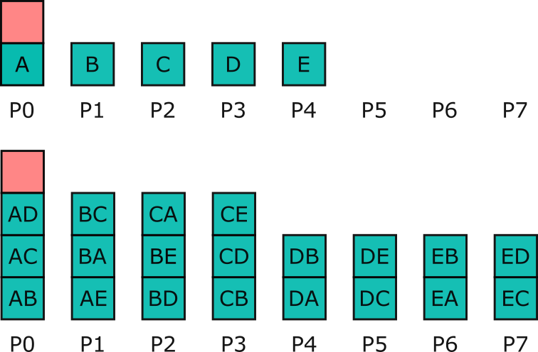
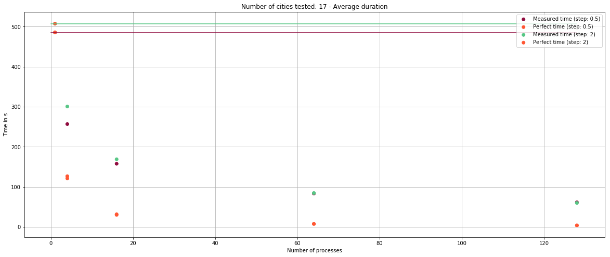
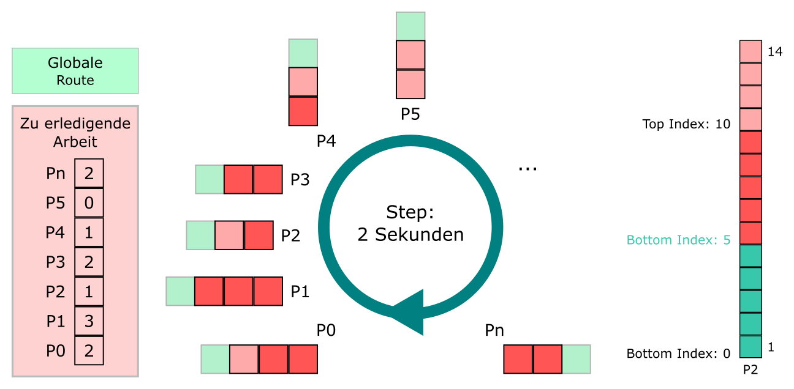

# HPC2020_Project2013 

**Autoren:**

- Protected
- Protected
 
## MILESTONE 1: Parallelisierung des Traveling Salesman Problems mit MPI

**Dokumentation**

Das Traveling Salesman Problem befasst sich mit der Fragestellung, wie ein Verkäufer effizient in mehreren Städten sein Produkt verkauft. Ein besonderer Fokus wird auf den zurückgelegten Reiseweg gelegt. Der Verkäufer startet in einer Anfangsstadt und möchte den kürzesten Weg zu den jeweiligen Städten finden. Jede Stadt soll nicht mehr als einmal besucht werden.

Der vorgegebene Code des seriellen Programms wurde in das Projekt Template eingebaut. Für die Übernahme des Seriellen Programms in das Template wurde die Main-Funktion der beiden Codes zusammengeführt. Das Hauptprogramm wird nach der Initialisierung der MPI-Ausführungsumgebung angetrieben und bis zur Terminierung ausgeführt. Darauf aufbauend sollte das Programm mit beliebig vielen Cores, Nodes und Threads mit MPI parallel ausführbar sein.	
In einer CSV-Datei werden in der ersten Zeile die Anzahl der Städte angegeben, danach alle Städte mit ihren Namen, Längen- und Breitengraden. Das Programm kann mit einer variablen Anzahl an Prozessen und Städten ausgeführt werden. Das heißt, falls mehrere Prozesse angegeben worden sind, wird das Programm auch dementsprechend oft aufgerufen. Zu Beginn des Programms findet eine Zeitmessung statt, welche am Anfang und am Ende die aktuelle Zeit misst. Am Ende wird die Endzeit minus die Startzeit genommen, um so die Dauer des Programms zu ermitteln. Dies dient später zum Geschwindigkeitsvergleich der Programme. Danach wird die CSV-Datei mitsamt der Namen, Längen- und Breitengraden eingelesen. Zusätzlich wird ein zweidimensionales Feld erstellt, wo alle Distanzen zwischen den einzelnen Städten berechnet und gespeichert werden. Anschließend wird der Stack und die Variable „Beste Route“ initialisiert. Dazu wird bei dem Stack das untere und obere Element auf null gesetzt und der „Besten Route“ eine sehr schlechte Länge zugewiesen. Als nächstes wird eine zusätzliche Route mit null Werten initialisiert und die erste Stadt hinzugefügt, welche in unserem Fall „Berlin“ ist. Diese Route wird als erster Wert des Prozessstapels behandelt.

Das Programm deckt mehrere Fälle ab.
Der erste mögliche Fall tritt dann auf, wenn das Programm mit einem Prozess ausgeführt wird. Dann holt sich das Programm den Stack mit der Startstadt und fügt dem Stack alle Routen mit den jeweiligen Städten hinzu. Dazu wird die Tiefe der Route um eins erhöht, die Länge der Route zwischen den zwei Städten berechnet und die benutzte Stadt als verwendet markiert. Dabei beschreibt die Tiefe der Route die Anzahl der Städte in der Route. Danach wird der Stack so lange abgearbeitet bis alle Routen durchgelaufen sind. Falls die Route länger ist als die beste Route, wird die Iteration schon vor dessen Beendigung abgebrochen. Wenn die neue Route kürzer ist als die aktuell beste Route, wird die neue Route als beste Route gespeichert.	
Der zweite Fall wäre, wenn es mehr Prozesse als Städte gibt. Dann wird allen Prozessen die kleiner sind als die Anzahl der Städte jeweils eine Startroute zugewiesen. Die anderen Prozesse werden automatisch beendet, da ihnen keine Aufgabe zugeteilt wurde.	
Der dritte Fall behandelt das Szenario, bei dem es mehr Städte als Prozesse gibt. Zudem wird unterschieden, ob die Anzahl der Städte durch zwei teilbar ist. Trifft dies zu, werden jedem Prozess gleich viele Startrouten auf dem Stack zugewiesen. Einzig dem ersten Prozess wird eine Route weniger zugewiesen, da die Startstadt nicht zweimal hinzugefügt werden kann. Ist die Anzahl der Städte nicht durch zwei teilbar, wird jedem Prozess der Rest auf die Länge des Intervalls addiert. Dadurch wird manchen Routen die gleiche Startroute zugewiesen, aber es werden alle abgearbeitet.	

Bei dem zweiten und dritten Fällen wird nach der Startrouten Zuteilung der Stack so lange abgearbeitet bis alle Routen durchgelaufen sind. Falls die Route länger ist als die beste Route, wird vorher schon abgebrochen. Wenn die Route kürzer ist als die beste, wird die neue Route als beste Route gespeichert.	
Jeder Prozess außer dem ersten Prozess sendet seine beste gefundene Route an den ersten Prozess. Dieser vergleicht die erhaltenen Routen und prüft, ob diese von der Länge kürzer sind als die bisherige beste Route.	
Zum Schluss gibt der erste Prozess die beste Route aus und wie viel Zeit er gebraucht hat.

Ausgeführtes Beispiel der Parallelisierung:

Date of Pitch 1: 26.05.2020

## MILESTONE 2: Reposity Wechsel und Analyse der Parallelisierung

- Protected
- Tim Sobania, tsobania

### Messungen
Um eine Aussage über den Erfolg des Parallelisierungsprozesses treffen zu können, werden verschiedene Szenarien auf ihre benötigte Laufzeit untersucht. Die einzelnen Szenarien variieren in der Anzahl an Städten, der Anzahl an Prozessen und der Anzahl an zugeteilten Prozessorkernen. Jedes Szenario wird wiederholt auf dem Cluster ausgeführt und die erzielten Ergebnisse zugehörig und gekennzeichnet mit den Szenario-Variablen in einer CSV gespeichert. Relevante abgespeicherte Ergebnisse sind insbesondere die Berechnungszeit aber auch die kürzeste Länge und die zugehörige Route.

$ Getestete Anzahl an Staedten = n_{Staedte} = 7 $
$$Getestete Staedte = [6, 12, 13, 14, 15, 16, 17] $$
$$Getestete Anzahl an Prozessen = n_{Prozesse} = 13$$
$$Getestete Prozessanzahlen= [1, 2, 3, 4, 5, 6, 7, 8, 9, 10, 16, 32, 64]$$
$$Getestete Anzahl an Prozessorkernen = n_{Prozessorkerne} = 7$$
$$Getestete Prozessorkernanzahlen = [1, 2, 4, 8, 16, 32, 64]$$
$$Wiederholungen der Szenarien = n_{Wiederholungen} = 10$$
$$n_{Staedte} * n_{Prozesse} * n_{Prozessorkerne} * n_{Wiederholungen} = 6370$$

Somit wurden insgesamt 6370 Messungen auf dem Cluster ausgeführt. Bei jeder Messung wird durch die Funktion
„save_results“ eine Zeile, in der die Szenario-Parameter zusammen mit den Ergebnissen enthalten sind, in einer CSV
angehängt.

### Erkenntnisse
Allgemein sind keine nennenswerten Vorteile durch die Parallelisierung entstanden und daher wurde im Folgenden ein Beispiel
gegeben, dessen Verhalten sich in anderen Messreihen widerspiegelt.
Hier ist ein Problemgröße von 14 Städten unter Verwendung von 64 Kernen gegeben.

Zu sehen sind in der ersten Abbildung die gemessenen Zeiten (y - Achse) und die Anzahl an Prozessen (x - Achse).
Der am weitesten links gelegene, orange Punkt ist die gemessene Zeit für einen Prozess. Dies ist die Referenzzeit. Die
darauffolgenden, die orangenen Punkte sind als optimale Zeiten für die Parallelisierung berechnet.
Durch eine Linie wurde die benötigte Zeit der seriellen Lösung im gesamten Diagramm gekennzeichnet.
Nur für Fall, dass eine Lösung unterhalb dieser Linie liegt, wurde ein verbessertes Verhalten durch die Parallelisierung
erreicht. In dunklem Rot sind die gemessenen Zeiten der Parallelisierung dargestellt.

Es ist zu erkennen, dass im Fall der ersten zehn Messungen beinahe ausschließlich Verschlechterungen im Zeitverhalten
vorliegen.
Eine Ausnahme bildet der Punkt bei sieben Prozessen, der einen minimalen zeitlichen Vorteil gegenüber der seriellen Lösung
bietet.
Erklären lässt sich dies dadurch, dass die Problemgröße von 14 Städten optimal auf sieben Prozesse aufgeteilt werden kann
und sich dadurch keine großen Wartezeiten während der Kommunikation ergeben.

Für alle Messwerte dessen Anzahl an Prozessen die Anzahl an angefahrenen Städten übersteigt (hier beginnend bei 16
Prozessen) ist kein gravierender Unterschied mehr erkennbar, da im Lösungsansatz alle Prozesse deren ID größer ist als die
Anzahl an Städten sich lediglich beenden und keinen weiteren Vorteil schaffen können.
Ein ähnliches Verhalten ist bei anderen Problemgrößen und Prozessanzahlen zu erkennen.

Wie unvorteilhaft die Ergebnisse sind, ist in der Grafik des Speedups deutlich zu erkennen. Der Speedup berechnet sich nach der Formel:

$$Speedup = Referenzzeit bei einem Prozess / gemessene Zeit$$

Der optimale Speedup (wiederum berechnet nach dem seriellen Ansatz) ist hier in blau dargestellt und der berechnete Speedup in orange. Alle Messungen liegen nahe der Nulllinie und es ist auch hier lediglich eine minimale Verbesserung bei sieben Prozessen zu erkennen.

Auch die Effizienz:

$$Effizienz = Speedup / Anzahl Prozesse$$

unterstützt die Erkenntnis, dass der gewählte Parallelisierungsansatz nicht optimal gewählt ist.
Liegt die Effizienz für 2 Prozessen zunächst noch bei ca. 35%, sinkt sie bei steigender Anzahl an Prozessen rasch ab.
Wiederum ist eine leichte Auffälligkeit bei 7 Prozessen zu erkennen, allerdings fällt die Effizienz gerade bei einer hohen Anzahl
an Prozessen sehr stark ab

### Optimierungsansatz
Aus den Erkenntnissen ergeben sich mögliche Optimierungsansätze. Da sich die Laufzeit des Programms verbessert, wenn die
Problemgröße passend auf die unterschiedlichen Prozesse aufgeteilt ist, könnte z.B. der Initialstapel kleinschrittiger verteilt
werden.

Durch diesen Ansatz würde implizit auch das Problem gelöst, dass in dem Fall, dass es mehr Prozesse als Städte gibt, einige
Prozesse ohne Arbeit blieben.

Des Weiteren könnte durch Verändern der Kommunikationsart (nicht blockierend, kleinere Datenmenge, Broadcast) eine
Verbesserung herbeigeführt werden. Bei einer großen Anzahl an Prozessen könnte es zusätzlich sinnvoll sein, einen Prozess
allein für die Kommunikation abzustellen.

Date of Pitch 2: 09.06.2020

## MILESTONE 3: Optimierungsergebnis und Vorbereitung auf die Forschungsfrage

### Optimierungen
Die Optimierungsansätze aus Milestone 1 wurden folgendermaßen umgesetzt:

Der Initialstapel wird vor dem Verteilen auf die Prozesse, durch Prozess 0 (Roter Kasten), solange kleinschrittiger aufgeteilt bis
alle Prozesse mindestens eine Aufgabe bekommen können. In der Grafik ist dieses Vorgehen für das Beispiel von 6 Städten und
8 Prozessen gezeigt:

Da bei n = 6 Städten nur 5 Routen vorhanden wären, wird weiter aufgelöst. Im nächsten Schritt haben wir:
$$  AnzahlRouten = (n-1) * (n-2) = 5 * 4 = 20$$
20 Routen sind genug für 8 Prozesse und es kann die Verteilung auf die Prozesse beginnen.

Dabei wurde auch die Kommunikation verbessert. Anstatt weiterhin MPI_Send und MPI_Recv zu nutzen, wird nun mit
MPI_Bcast, MPI_Scatterv und MPI_Gather gearbeitet. Durch MPI_Bcast können wir allen Prozessen die Größe der zu
empfangenden Daten mitteilen. Das wird für die Kommunikation mittels MPI_Scatterv benötigt.

MPI_Scatterv verteilt die Routen so an alle Prozesse, wie es in der Grafik oben zu sehen ist. Diese Kommunikation wird durch
das rote Kästchen angedeutet.

Nach der Berechnung aller Routen sammelt MPI_Gather die Ergebnisse und vergleicht sie miteinander.

### Messungen
Die Messungen aus Milestone 1 wurden nun mit den vorgeschlagenen Optimierungen wiederholt.

Zur besseren Nachvollziehbarkeit der Optimierungsergebnisse werden an verschiedenen Punkten im Code die Zeiten
gemessen. Die Ergebnisse sind in folgender Grafik dargestellt:

Auf der Y-Achse sind die einzelnen Prozesse zu sehen. Es wurde in diesem Beispiel mit 64 Prozessen gearbeitet. Auf der XAchse ist die benötigte Zeit jedes Prozesses in unterschiedlichen Farben dargestellt.
Zuerst fällt auf, dass die Prozesse 53 bis 63 keine Berechnungen durchführen. Dies liegt an der Verteilung der Anfangsrouten
durch MPI_Scatterv. Mit Verbesserung der Aufteilung entsteht folgender Plot:

Interessant an dieser Darstellung ist die Erkenntnis, dass die meiste Zeit für die Berechnungen aller Routen sowie der
abschließenden Kommunikation benötigt wird.

Der Effekt, dass das MPI_Gather so viel Zeit beansprucht, begründet sich allerdings darin, dass auch die Berechnungszeiten
der Prozesse sehr unterschiedlich ausfallen.

Zur weiteren Verbesserung dieser Auffälligkeiten werden im Kapitel "Potentielle weitere Optimierungen" Vorschläge gegeben.

In der vorhergehenden Grafik sind die **gemessenen Berechnungszeiten** nach der Optimierung der Parallelisierung bei den
Ausgangsproblemgrößen von 6, 12, 13 und 17 Städten abgebildet. Es wird deutlich, dass eine Parallelisierung bei einer zu
kleinen Problemgröße keine Verkürzung in der Berechnungszeit hervorruft. Werden die gemessenen Zeiten bei der
Problemgröße von nur sechs Städten betrachtet, so stellt sich heraus, dass durch die Kommunikation unter den Prozessen die
Berechnungszeit erhöht. Dies wird **Overhead** genannt und wird tragender je mehr Prozesse bei der Kommunikation beteiligt
sind. Durch das Konzept der Aufteilung der Problemgröße in Seeds, ist ab einer Zuweisung von 61 Prozessen das Problem
bereits in der Initialisierung vollständig gelöst.

Der Overhead der Parallelisierung ist ebenfalls deutlich in den Grafiken zu den Problemgrößen von 12 und 13 zu sehen.
Ersichtlich wird dies bei dem Anstieg der Zeiten ab einer gewissen Anzahl an Prozessen im Vergleich zu der Problemgröße von
17 Städten, bei denen die gemessenen Zeiten mit zunehmender Prozesszahl sinken. Das bedeutet, dass die Parallelisierung
insgesamt bei steigenden Problemgrößen im Vergleich zu der seriellen Berechnung eine Verbesserung (Verkürzung) in der
Berechnungszeit bringt.

Wird der **Speedup** nach der Optimierung betrachtet (siehe folgende Grafik), dann wird deutlich, dass durch die Optimierung nun
eine Verkürzung der Berechnungszeit in der Parallelisierung im Vergleich mit der seriellen Berechnung erreicht werden konnte.
Der Speedup ist jedoch noch weit entfernt von dem möglichen Speedup bei einer sofortigen, nicht in Gewicht tretenden
Kommunikation (kein Overhead). Dies ist zu sehen in der flachen Verteilung der Punkte sowohl vor (siehe Milestone 2) als auch
nach der Optimierung.

Folglich konnte auch die **Effizienz** durch die vorgenommene Optimierung verbessert werden. In der nachfolgenden Grafik wird
allerdings deutlich, dass diese immer noch relativ schlecht ausfällt. Das bedeutet im Konzept der Parallelisierung gesprochen,
dass die Berechnungszeit nur durch einen hohen Ressourcenaufwand verkürzt wird. Die Ressourcen werden also nicht optimal
genutzt.

### Potentielle weitere Optimierungen

1. In der Initialisierun die zu verteilende Problemgröße vergrößern. Im Näheren bedeutet das, dass die Seeds, die mit dem
Scatter verteilt werden in der Initialisierung eine Ebene weiter aufgeteilt werden. Dadurch wird insgesamt durchschnittlich
eine bessere Verteilung auf alle Prozesse erreicht.

2. Vor der Verteilung der Seeds auf die einzelnen Prozesse, das Array, indem die Seeds liegen, mischen. Da die Gesamtzeit
von der Berechnungszeit des langsamsten Prozesses abhängt, kann durch eine zufällige Verteilung der Seeds das WorstCase-Szenario, in dem ein Prozess genau die Seeds verteilt bekommt, die am Anfang der Berechnung eine
vielversprechende (gute, kurze) Route versprechen und erst am Ende in den letzten Schritten zu lang werden, verhindert
werden. Insgesamt wird in Kombination der weiteren Aufspaltung der Seeds eine Angleichung der Berechnungszeiten
innerhalb aller Prozesse erreicht.

3. Nach Möglichkeit allen Prozessen global die kürzeste Länge zur Verfügung stellen. Dieser Schritt führt dazu, dass lange
Routen früher erkannt werden.

4. In Kombination mit der globalen, kürzesten Länge durch einen Algorithmus mit einer vielversprechenden (kurzen) Route
noch vor den Berechnungen (vor dem Scatter) initialisieren.

### Forschungsfrage

Die Forschungsfrage behandelt Problemstellungen die momentan noch nicht, nicht optimal oder eventuell sogar gar nicht gelöst
werden können. Dazu gehört auch das Traveling Salesman Problem.

Die Komplexität der Aufgabe steigt bei wachsender Problemgröße (Anzahl der Städte) mit dem in diesem Projekt gewählten
Ansatz enorm an. Auch durch weitere Optimierungen wird der Algorithmus früher oder später an seine Grenzen stoßen.

Date of Pitch 3: 23.06.2020

##  MILESTONE 4: Finale Optimierung

In diesem Meilenstein werden letzte vielversprechende Optimierungen vorgenommen, die im Meilenstein davor und im weiteren Verlauf ermittelt wurden. 

### Global vorgehaltene kürzeste Route

Bereits im vergangenen Meilenstein ist das Vorhalten der global kürzesten Länge als weiterer Optimierungsschritt ermittelt
worden. Es wird eine Verbesserung erzielt, indem jede neu ermittelte Route in einem Prozess mit einer global bekannten Route
verglichen wird. Ist die neu ermittelte Route besser, wird diese zur neuen global besten Route. Diese Aktualisierung wird global
bekannt gemacht. Das bedeutet, an diesem Punkt wird jedem einzelnen Prozess mitgeteilt, wie die neu gefundene Route
definiert ist. Insgesamt heißt das, dass es nicht wirklich eine globale Route gibt, auf die die Prozesse zugreifen können, sondern
dass jeder Prozess eine eigene quasi-globale Routenvariable enthält, die aber in jedem Prozess den gleichen Stand hat.

Dadurch werden im weiteren Verlauf schlechte Routen insgesamt früher erkannt und abgebrochen. Vom Prinzip her ähnelt
dieser Effekt dem Ansatz einer initialisierten, vielversprechenden Route. Dies spart Zeit und Ressourcen ein. Interessant ist
jedoch, ob wirklich eine zeitliche Verbesserung erreicht werden kann, da zwar Zeit eingespart wird, aber gleichzeitig durch
weitere Kommunikation zusätzlicher Overhead dazu kommt.

### Messungen

In dieser Grafik ist der Effekt des Synchronisierens gut sichtbar. Alle Prozesse benötigen in etwa die gleiche Zeit. Dies liegt jedoch daran, dass rhythmisch synchronisiert wird und kein Prozess sich beendet bevor alle anderen fertig sind.
Aber auch etwas anderes ist hier und im Vergleich mit anderen Messungen zu sehen: Da die Synchronisation einem bestimmten Intervall folgt kann nur zu vielfachen dieses Intervalls die Berechnung beendet werden. In diesem Fall wurde alle zwei Sekunden synchronisiert und daher ist die Berechnung nach vier Sekunden beendet.
Es ist allerdings möglich, dass die Berechnung schon kurz nach der letzten Synchronisation fertig war und dann lediglich noch gewartet wurde.

Eine Verbesserung der Zeiten ist in diesem Grafen, im Vergleich zu vorherigen Messungen zu erkennen. Bei einer großen Problemgröße und Prozessoranzahl fällt die Synchronisation ins Gewicht und das Ergebnis kann schneller erreicht werden.

Der Speedup hat sich in der erweiterten Optimierung erneut verbessert. Lag er im Meilenstein 3 bei einer Problemgröße von 17 Städten und 128 verwendeten Kernen bei 4.3 so liegt er nun nach der erweiterten Optimierung um die global gehaltene, kürzeste Route bei 8.5. Somit konnte dieser fast verdoppelt werden.

Da die Effizienz und der Speedup korrelieren, konnte auch bei der Effizienz eine beinahe Verdopplung erreicht werden. Bei einer Problemgröße von 17 Städten und 128 verwendeten Kernen liegt die Effizienz beispielsweise nun bei ca. 6.6% im Vergleich zu vorher 3.4%.

### Aussicht: Work stealing

Ein Konzept, das während des Pitches zum dritten Meilenstein aufgekommen und besprochen wurde, ist das sogenannte "Work
stealing". Dabei geht es vereinfacht ausgedrückt darum, dass ein mit seinen Aufgaben (Seeds) abgearbeiteter Prozess von
einem anderen Prozess zu erledigende Arbeit (Seeds) stiehlt. Somit werden im Berechnungsverlauf Seeds nach Bedarf
dynamisch umverteilt und somit Leerzeiten vermieden und stattdessen vorhandene freie Ressourcen genutzt.

Dieser Optimierungsschritt wurde gewählt, um das Problem der Gleichverteilung des Arbeitsaufwandes auf alle Prozesse zu
verbessern. Er stellt eine Alternative zu der zufälligen Verteilung der Seeds in der Initialisierung dar, ist dabei aber flexibler und
trotzdem robust, da Probleme (zu wenig Arbeit) kontinuierlich beim Auftreten behoben werden und nicht abhängig vom Zufall
sind.

Date of Pitch 4: 10.07.2020

## MILESTONE 5 & 6: Abgabe finale Dokumentation & Fazit

### Zusammenfassung Milestones 1-4

Nachdem im ersten Meilenstein der serielle Ansatz (ein Prozess) des Traveling Salesman Problems parallelisiert worden ist, wurden die Ergebnisse daraus in Meilenstein zwei gemessen und grafisch dargestellt.
Weitere Optimierungen daran wurden anschließend in Meilenstein drei und vier vorgenommen und jeweils ausgewertet.
Im dritten Meilenstein konzentrieren sich die Verbesserungen auf die initiale Kommunikation zur Aufteilung des Problems auf die Prozesse.
Der vierte Meilenstein führt eine anschließende Kommunikation während der Berechnung ein, wodurch die Ressourcennutzung weiter optimiert werden kann.

### Vergleich der Messungen

Im Folgenden sind die Messergebnisse der Meilensteine noch einmal in einer Übersicht zusammengefasst. Es ist jeweils das Beispiel mit 17 Städten dargestellt.

Die benötigten Zeiten der Berechnungen unterscheiden sich deutlich voneinander. Im zweiten Meilenstein benötigen noch ausnahmslos alle parallelen Ausführungen länger als der serielle Ansatz.
Der schlechteste Pfad benötigt sogar knapp 1500 Sekunden = 25 Minuten.

Im Gegensatz dazu ist in Meilenstein drei eine deutliche Verbesserung zu erkennen. Die Zeiten sind mit einer Ausnahme besser als der serielle Ansatz.

Zuletzt konnten diese Ergebnisse im vierten Meilenstein weiter optimiert werden.

Ähnliches ist auch anhand der Speedups zu sehen. Ist im ersten Grafen noch kein Trend zu erkennen, gibt der zweite bereits mehr Informationen her. Ein Aufwärtstrend lässt sich hier zumindest erahnen.

Im vierten Meilenstein ist die logarithmische Natur der Parallelisierung deutlich zu sehen.

Analoge Ergebnisse dazu liefern die Grafen der Effizienz. Man beachte die Tatsache, dass in den Meilensteinen zwei und drei jeweils 2, 4, 8, 16, 32, 64 und im dritten Meilenstein sogar 128 Prozesse verwendet wurden.
Im vierten Meilenstein wurden lediglich 4, 16, 64 und 128 Prozesse gemessen.

### Fazit

In allen vorgenommenen Optierungen des Traveling Salesman Problems geht es stets darum, die genutzten Ressourcen (Zeit, Rechenaufwand) zu minimieren und dadurch auch große Problemstellungen effizient lösen zu können.
Ob die hier erarbeitete Lösung Sinnvoll zu nutzen ist lässt sich nur individuell feststellen und begründet sich auf Randbedingungen wie z.B. der gegebenen Zeit, der Größe der Aufgabenstellung und der Frage wie exakt das Ergebnis sein muss.

Klar ist, dass dieser Ansatz *beweisbar* die, oder eine korrekte Lösung des Problems liefert, da alle möglichen Pfade getestet werden. Sollte diese Korrektheit nicht gefordert sein, kann mit anderen Algorithmen ein effizienterer Lösungsweg gewählt werden.
Auch ist eine Kombination dieser Algorithmen denkbar. Würde Beispielsweise zunächst ein sehr guter Pfad ermittelt werden, könnte der hier gegebene Algorithmus deutlich effizienter bearbeitet werden.

Date of Milestone 5: 14.07.2020
Date of Pitch 6: 17.07.2020
